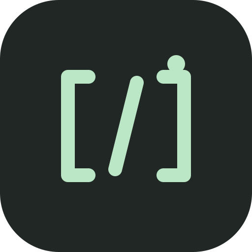
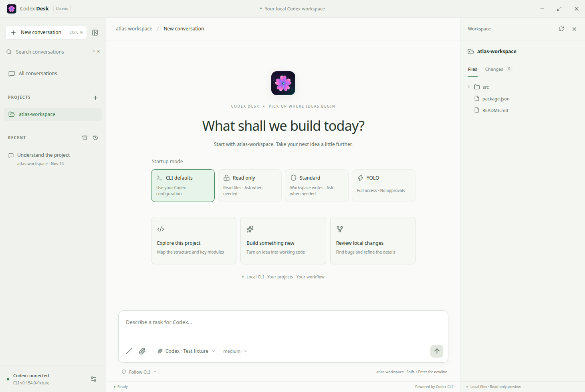

<p align="center"></p>

# Codex Desk

**A focused Ubuntu desktop workspace for Codex CLI.**

Manage projects, pick up existing CLI conversations, watch Codex work, and review changes in one place. Built from scratch with Electron, React, and TypeScript. English and 简体中文 interfaces; dark and light themes.

[Download for Ubuntu](https://github.com/moristeven477-ship-it/codex-desk/releases/latest) · [中文说明](README.zh-CN.md) · [Architecture](docs/ARCHITECTURE.md) · [Contributing](CONTRIBUTING.md)



_Screenshots show a synthetic test workspace. The application uses your real local Codex CLI._

## What it does

- Bookmark local project folders and find conversations by project or title.
- Browse and continue persisted Codex CLI / IDE / app-server conversations, with paginated history.
- Create, rename, fork, archive, and restore conversations.
- Stream replies, command output, reasoning summaries, plans, and file changes.
- Run conversations independently and stop a running turn.
- Respond to command/file approvals, permission requests, and Codex questions. Pending requests remain accessible across conversations.
- Choose a model, reasoning effort, and permission mode. Model choices come from your installed Codex.
- Paste screenshots and copied images with **Ctrl+V**, or use the native image picker. Preview/remove attachments before sending (8 images per message, 20 MiB each).
- Choose **CLI defaults / Read only / Standard / YOLO** before starting a conversation.
- Receive top completion notices and Ubuntu background notifications; click to reopen the finished conversation.
- Browse local files and inspect staged, unstaged, and untracked Git changes.
- Switch between English / 简体中文 and dark / light themes.
- Start immediately in a default workspace, with drafts saved across restarts.
- Share one conversation with the real CLI: messages, approvals, settings, and goals use the same local app-server.
- Automatically prepare a background **Ubuntu Terminal** tab for each conversation you create or select. Reopening the conversation reuses its terminal.
- Open the complete `/` command menu, graphical goal / plan / status controls, and an embedded real Codex terminal.
- Use detailed model / effort / permission popovers and an original gradient SVG neon sakura icon.

## Install on Ubuntu

**Release target: Ubuntu 24.04 x86-64.** Other distributions and CPU architectures have not been validated.

### 1. Prepare Codex

Install [Codex CLI](https://learn.chatgpt.com/docs/cli) and authenticate it:

```bash
npm install -g @openai/codex
codex login
```

If Codex already works in your terminal, keep that installation. Codex Desk discovers common npm, nvm, Volta, and local binary locations. You can also choose an absolute executable path in **Settings → Codex CLI**. Tested against **codex-cli 0.154.0**; older/newer protocol versions may differ.

### 2. Install the desktop application

Download the `.deb` from [Releases](https://github.com/moristeven477-ship-it/codex-desk/releases/latest), then run:

```bash
sudo apt install ./codex-desk-0.2.2-amd64.deb
```

Launch **Codex Desk** from Ubuntu's application menu, or run `codex-desk`.

The package includes the Electron runtime; Node.js is needed separately only for an npm-installed Codex CLI or source development. Git powers the optional changes inspector.

### Portable AppImage

```bash
chmod +x codex-desk-0.2.2-x86_64.AppImage
./codex-desk-0.2.2-x86_64.AppImage
```

If FUSE is unavailable, run without mounting the AppImage:

```bash
APPIMAGE_EXTRACT_AND_RUN=1 ./codex-desk-0.2.2-x86_64.AppImage
```

The `.deb` is recommended on Ubuntu 24.04: its installer includes Electron's Ubuntu AppArmor integration. Do not disable Chromium's sandbox to work around an installation problem. See [Troubleshooting](docs/TROUBLESHOOTING.md).

## First conversation

1. Describe a task immediately, or open a project folder in the sidebar. With no project selected, Desk creates `~/Codex/workspace`; change it in **Settings → General → Default workspace**.
2. Select an existing conversation or start a new one.
3. Choose the model and permission mode below the composer.
4. Send a task. Watch progress, answer any requests, and inspect changes on the right.

**Default mode:** follow your effective Codex CLI configuration. Read-only, Standard, and YOLO are available as explicit choices.

| Shortcut      | Action               |
| ------------- | -------------------- |
| `Ctrl+N`      | New conversation     |
| `Ctrl+K`      | Search conversations |
| `Ctrl+,`      | Settings             |
| `Enter`       | Send                 |
| `Shift+Enter` | Newline              |

Language: **Settings → General → Language**. Appearance preferences are saved automatically.

## CLI ↔ Desk synchronization

Creating or selecting a conversation automatically opens its real CLI in **Ubuntu Terminal**. The first window is minimized from the start; subsequent conversations become background tabs in that window. Find it using Ubuntu's Terminal icon or window switcher. Desk does not raise it or change its selected tab. Repeated selections and Desk restarts reuse the same CLI process; closing a CLI lets Desk recreate it on the next selection. Closing Desk leaves native terminals running.

New conversations are created before the first message, so their terminals are ready immediately. Startup mode choices remain visible and update the same shared conversation. The status bar shows when the terminal is ready, waiting for a standalone writer, or needs a retry. Archived history does not open terminals.

This integration uses the installed **GNOME Terminal and Python GObject bindings**. The `.deb` installs them; AppImage users can install them with `sudo apt install gnome-terminal python3-gi`. Automatic background presentation is validated on Ubuntu 24.04 X11. Desk uses its own Terminal window and never modifies existing terminal tabs.

Open a conversation and click **CLI sync**, or use a command marked **CLI** to open the embedded terminal. Both connect to the same official app-server with the same thread ID:

```bash
codex --remote unix:// resume YOUR_THREAD_ID
```

Use the copyable command in Desk when you have a custom executable or `CODEX_HOME`. Messages and goal changes stream between subscribed clients. The conversation list refreshes every three seconds. Closing Desk disconnects its clients; the shared server and running tasks remain available.

**Moving an existing standalone CLI:** finish its task and exit that original CLI once. Desk keeps showing its history and preserves your draft, then automatically attaches when the writer is released. Reopen it using **CLI sync**. A standalone CLI cannot be hot-attached while it owns the writer; Desk preserves the original ID and does not create a replacement fork.

## Slash commands and goals

Click **/** beside the attachment button, or type a slash command in the composer. The searchable menu includes all **60 command definitions** and aliases from Codex CLI 0.154.0. `/goal`, `/plan`, `/status`, model / permissions, and common conversation actions have graphical controls. The remaining commands open the real CLI inside Desk: insert the selected command at its input prompt, then press Enter. Its own pickers and confirmations remain available. You can also type custom or newly added commands directly in that terminal.

Platform-specific, debug, and feature-gated commands are labeled **Conditional**. Their availability is decided by the installed Codex; listing them does not enable unsupported features on Ubuntu. See the [command inventory](docs/COMMANDS.md).

An existing goal appears at the top right of its conversation. Open it to view the objective, status, token budget, usage, and elapsed active time; edit, pause, resume, or clear it. Budget is optional. CLI goal notifications update the same panel. `/plan` selects Codex's actual collaboration mode for the next task; **Exit plan mode** returns to normal execution.

The embedded terminal uses Ubuntu's `python3` PTY support and xterm.js. It runs your installed Codex executable, connected through `--remote unix://`.

## CLI settings take priority

Existing conversations inherit the CLI's live permissions, approval policy, model, reasoning effort, and plan/default mode. Merely opening a conversation or sending a message does not replace those settings. An explicit selection in Desk changes the corresponding setting for the next turn and is synchronized through Codex.

New conversations offer these startup modes:

| Mode         | Codex settings                                                     |
| ------------ | ------------------------------------------------------------------ |
| CLI defaults | Use the effective Codex configuration without permission overrides |
| Read only    | `read-only` sandbox, `on-request` approvals                        |
| Standard     | `workspace-write` sandbox, `on-request` approvals (`--full-auto`)  |
| YOLO         | `danger-full-access` sandbox, `never` approvals (`--yolo`)         |

A standalone CLI still owns its conversation while it is open. Desk can display its last saved permissions; live permission updates require the shared connection. When an unloaded legacy conversation is resumed, Desk restores permissions from its latest readable saved turn context. If that context is unavailable, the standalone view reports Follow CLI; after a successful resume, Desk displays the settings returned by Codex. Custom live policies remain intact unless you explicitly select a Desk preset. Managed Codex requirements still apply.

Completion banners disappear after eight seconds and can be dismissed or clicked to open the conversation. When Desk is in the background, Ubuntu also receives a native notification, subject to your desktop notification settings.

## Local data and authentication

The renderer talks to Electron through validated IPC. Desk connects to the official app-server using **WebSocket over a local Unix domain socket**, with no TCP listening port or cloud relay. If absent, it starts the shared server. npm installations that cannot use `app-server daemon start` use a detached official `app-server --listen unix://…` listener. No application telemetry is added.

- Conversations and authentication remain in Codex's own home directory, normally `~/.codex`.
- Project bookmarks and preferences are stored in Electron's user-data directory, normally `~/.config/Codex Desk/state.json`.
- Pasted images are saved privately in `~/.config/Codex Desk/attachments/` as PNGs and retained so existing CLI conversation references remain valid. Unsent image selections are not restored after restarting Desk.
- Unsent text drafts are saved in the renderer's local storage under that same application data directory.
- Native terminal screen IDs and process identity markers are kept privately in `~/.config/Codex Desk/terminals/` to avoid duplicates. They contain no authentication data.
- Codex Desk does not copy API keys or authentication files into its own store.
- Codex still contacts the configured model provider and tools. Subscription limits / API billing continue to apply.
- Removing a project bookmark does not delete its files. Archiving uses Codex's archive operation and can be reversed.

The file inspector validates canonical paths and rejects symbolic links that escape the selected project. The renderer uses context isolation, a sandbox, a restrictive content security policy, and no Node integration. See [Security](SECURITY.md).

## Current boundaries

- The file/Git inspector is read-only; ask Codex to make edits.
- Live synchronization requires the shared server. An already-running standalone CLI needs the one-time reconnect described above.
- No remote hosting, automatic updater, scheduling, or other AI-provider adapters.
- Native file/image pickers and window controls require the desktop application. The Vite browser view is a development/test surface.
- MCP form requests currently use a JSON response field. Unsupported client protocol requests are rejected explicitly instead of silently approved.

## Develop

Use Node.js 22.16+, npm, Python 3, and a C compiler (`build-essential` on Ubuntu). Native terminal tests also need `gnome-terminal python3-gi gir1.2-gtk-3.0 openbox xvfb dbus-x11 x11-utils xauth libxtst6`:

```bash
git clone https://github.com/moristeven477-ship-it/codex-desk.git
cd codex-desk
npm ci
npm run dev
```

React changes reload automatically. Restart `npm run dev` after editing Electron/main-process code.

```bash
npm run typecheck
npm test
npx playwright install chromium
npm run test:e2e
npm run build
npm run package:linux
```

Packages appear in `release/`. The native smoke check uses a synthetic CLI and temporary data:

```bash
npm run test:terminal
DESK_TEST_CLIPBOARD=1 npm run test:native
```

Optional checks against your own installed Codex:

```bash
npm run test:live            # connection, models, and history; no model turn
npm run test:live -- --turn  # one isolated read-only model turn; uses your quota
npx tsx scripts/live-sync.ts --turns  # real TUI ↔ Desk messages and goals; uses your quota
```

Terminal and native checks automatically use a private Xvfb display and D-Bus session, without starting user desktop services. The live-turn check archives only the test conversation it creates. No live Codex checks run in CI.

## Design and license

The project/workspace layout takes inspiration from Qoder; the conversation and composer take inspiration from ChatGPT. The implementation, styling, and icon are original. This is an independent community project, unaffiliated with OpenAI or Qoder.

[MIT](LICENSE). Built on the official [Codex app-server protocol](https://learn.chatgpt.com/docs/app-server). See [third-party notices](THIRD_PARTY_NOTICES.txt) and [release validation](docs/VALIDATION.md).
