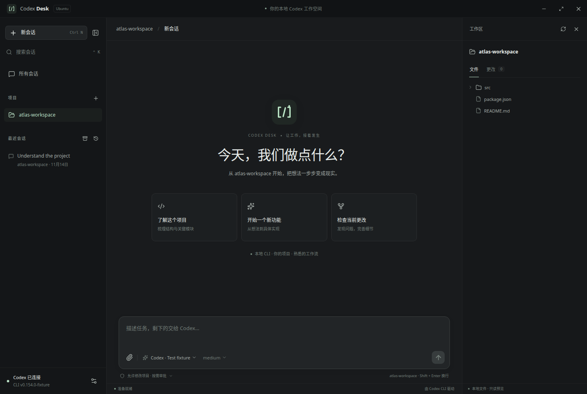

# Codex Desk

**专为 Codex CLI 开发的 Ubuntu 桌面工作空间。**

从零实现。采用 Electron、React、TypeScript；提供完整中文和英文界面，以及深色、浅色主题。

[下载 Ubuntu 安装包](https://github.com/moristeven477-ship-it/codex-desk/releases/latest) · [English](README.md)



_截图使用测试项目，应用实际连接本机 Codex CLI。_

## 主要功能

- 管理项目目录，按项目或标题查找会话。
- 读取并继续已有 CLI、IDE、app-server 历史会话，支持分页。
- 新建、重命名、分叉、归档和恢复会话。
- 实时显示回复、命令输出、思考摘要、执行计划与文件修改。
- 多个会话分别运行；随时停止当前任务。
- 在界面中处理命令、文件和权限审批，以及 Codex 的问题。
- 选择模型、推理强度、权限模式；支持 **Ctrl+V 粘贴截图和复制的图片**，或通过原生文件选择器添加图片。发送前可预览、移除，每条消息最多 8 张，每张不超过 20 MiB。
- 新会话选择 **跟随 CLI 配置 / 只读 / 标准模式 / YOLO**。
- 任务完成后显示顶部提醒；后台完成会发送 Ubuntu 系统通知，点击可返回对应会话。
- 浏览项目文件，查看 Git 暂存、未暂存和未跟踪更改。
- 中英文切换，深浅色主题，侧栏与文件面板调整。
- 无须先选项目，直接在默认工作区开始；文字草稿跨重启保存。
- CLI 与 Desk 共用同一会话，实时同步消息、审批、设置和目标。
- 创建或点开会话时，自动在 Ubuntu 终端中准备对应的后台标签页；重复打开会复用同一个 CLI 进程。
- 完整 `/` 命令菜单、内置真实 CLI、右上角目标面板。
- 带说明与选中状态的模型弹窗，以及渐变赛博朋克樱花 SVG 图标。

## 安装

发布目标为 **Ubuntu 24.04、x86-64**，其他系统和架构尚未验证。

### 准备 Codex CLI

如果终端中已经能使用 Codex，可以保留现有安装与登录状态。否则先安装并登录：

```bash
npm install -g @openai/codex
codex login
```

应用会自动查找常用 npm、nvm、Volta 和本地可执行文件目录。找不到时，可在「设置 → Codex CLI」中填写完整路径。已验证 CLI 版本为 **0.154.0**。

### Ubuntu 安装包

从 [Releases](https://github.com/moristeven477-ship-it/codex-desk/releases/latest) 下载 `.deb`：

```bash
sudo apt install ./codex-desk-0.2.2-amd64.deb
```

安装后在 Ubuntu 应用菜单中打开 **Codex Desk**，或运行 `codex-desk`。

也可下载便携 AppImage：

```bash
chmod +x codex-desk-0.2.2-x86_64.AppImage
./codex-desk-0.2.2-x86_64.AppImage
```

没有 FUSE 时：

```bash
APPIMAGE_EXTRACT_AND_RUN=1 ./codex-desk-0.2.2-x86_64.AppImage
```

Ubuntu 24.04 优先使用 `.deb`，安装器包含 Electron 的 AppArmor 集成。遇到沙箱错误时参考[故障排查](docs/TROUBLESHOOTING.md)，不要通过关闭沙箱解决。

## 开始使用

1. 直接输入任务，或在左侧打开项目。未选项目时，应用自动使用 `~/Codex/workspace`，可在「设置 → 通用 → 默认工作区」更改。
2. 选择历史会话，或新建会话。
3. 在输入框下选择模型、推理强度和权限模式。
4. 描述任务，查看执行进度，并在需要时回答或授权。
5. 在右侧浏览文件与代码差异。

默认允许修改项目，并按需请求授权；也可以选择只读或完全访问。权限由 Codex 执行。

「设置 → 通用 → 界面语言」可切换 English / 简体中文。「外观」可切换深浅色，设置自动保存。

| 快捷键        | 操作     |
| ------------- | -------- |
| `Ctrl+N`      | 新会话   |
| `Ctrl+K`      | 搜索会话 |
| `Ctrl+,`      | 设置     |
| `Enter`       | 发送     |
| `Shift+Enter` | 换行     |

## CLI 设置优先

已有会话默认继承 CLI 的实时沙箱、审批策略、模型、推理强度和计划模式。打开会话或发送普通消息不会覆盖它们；只有在 Desk 主动选择设置时，才在下一轮应用对应变更，并通过 Codex 同步。

新会话提供以下启动模式：

| 模式          | Codex 设置                                                     |
| ------------- | -------------------------------------------------------------- |
| 跟随 CLI 配置 | 使用当前有效配置，不覆盖权限                                   |
| 只读          | `read-only` 沙箱 + `on-request` 审批                           |
| 标准模式      | `workspace-write` 沙箱 + `on-request` 审批，对应 `--full-auto` |
| YOLO          | `danger-full-access` + `never`，对应 `--yolo`                  |

独立 CLI 打开期间仍拥有该会话。Desk 显示其最近保存的权限，实时权限同步需要共享连接。恢复尚未加载的旧会话时，Desk 从最近可读取的会话记录恢复权限；没有可用记录时，独立 CLI 会话显示「跟随 CLI」；成功恢复后显示 Codex 返回的实际设置。未主动选择 Desk 预设时，CLI 的实时自定义权限保持原样。Codex 的受管要求仍然生效。

完成提醒在 8 秒后自动消失，也可以手动关闭或点击查看会话。Desk 位于后台时还会发送原生通知，其显示遵循 Ubuntu 的通知设置。

## 数据与边界

应用通过本机 Unix socket 上的 WebSocket 连接官方 `codex app-server`，不监听 TCP 端口、不提供云中转、不收集应用遥测。服务不存在时自动启动；npm 版无法使用官方 daemon 安装入口时，会启动独立于 Desk 生命周期的官方 Unix 监听进程。

- 会话与登录凭证仍由 Codex 管理，通常位于 `~/.codex`。
- 项目书签与偏好通常位于 `~/.config/Codex Desk/state.json`。
- 粘贴图片以私有 PNG 文件保存于 `~/.config/Codex Desk/attachments/`，会持续保留以便 CLI 读取历史引用。重启 Desk 不会恢复尚未发送的图片选择。
- 文字草稿保存在同一应用数据目录下的本地存储中。
- 应用不另行复制 API Key 或 Codex 登录文件；模型仍使用原有订阅额度或 API 计费。
- 文件面板是只读预览；文件编辑由 Codex 完成。移除书签不会删除项目文件。
- 实时同步要求 CLI 与 Desk 连接同一共享服务，独立 CLI 需要按下方说明重新连接一次。
- 关闭 Desk 会断开它的客户端，共享服务与运行任务继续保留。
- 本版不含远程访问、自动更新、定时任务或其他模型代理的接入。
- MCP 表单暂用 JSON 字段回答；尚未实现的客户端协议请求会明确拒绝。

## CLI 与 Desk 双向同步

新建或选择会话时，Desk 会自动在 **Ubuntu 的终端应用**中打开对应 CLI。首次窗口直接最小化，后续会话加入该窗口的后台标签页，不抢焦点，也不切换当前终端标签。需要使用时，从 Ubuntu 的终端图标或窗口切换器找到它。

重复选择会话、重启 Desk 会复用已有终端；关闭 CLI 后再次选择会话会重新准备。关闭 Desk 后，这些原生终端继续运行。已有其他终端窗口和标签页保持原样。

新会话在首条消息前就已创建，启动模式仍可选择，主动更改会立即同步到同一个 CLI 会话。状态栏显示后台终端是否就绪，并提供重试入口。独立 CLI 正在占用的会话会等待其释放；归档历史不会自动启动终端。

依赖系统的 `gnome-terminal` 和 `python3-gi`，`.deb` 会自动安装。使用 AppImage 时可运行 `sudo apt install gnome-terminal python3-gi` 安装这两个组件。后台窗口行为已在 Ubuntu 24.04 X11 验证。

打开会话，点击「CLI 同步」，或从 `/` 菜单打开内置终端。两边使用同一个会话 ID：

```bash
codex --remote unix:// resume 会话ID
```

有自定义 Codex 路径或 `CODEX_HOME` 时，直接复制「CLI 同步」中的完整命令。订阅会话的消息与目标实时推送，会话列表每 3 秒刷新。

**已有独立 CLI 的会话：**先完成当前任务并退出原 CLI 一次。Desk 保留原 ID、历史和草稿，并在写入占用解除后自动连接。此后用「CLI 同步」重新打开，就能在两边继续同一对话。不能热接管仍由独立 CLI 占用的会话，也不会自动分叉成另一份。

## 完整 `/` 命令与目标

输入框附件按钮旁的 **/** 可打开搜索菜单，也可以直接在输入框输入命令。菜单收录 CLI 0.154.0 的全部 **60 条命令定义及别名**。`/goal`、`/plan`、`/status`、模型、权限和常用会话操作使用图形界面；其余命令打开内置真实 CLI，在出现输入提示后点击「填入命令」，按 Enter 执行。CLI 自带的选择器与确认交互均可使用，也能直接输入自定义或新版本增加的命令。

平台、调试构建或实验功能限定的命令标记为「条件可用」，实际由本机 Codex 判断；收录到菜单不会强行启用 Ubuntu 不支持的功能。另见[命令清单](docs/COMMANDS.md)。

会话有目标时，右上角显示目标状态。点击后可查看目标内容、token 预算、用量与累计时间，并编辑、暂停、继续或清除目标。预算可不填，CLI 中的目标变化会同步更新。`/plan` 为下一条任务选择真正的 Codex 计划模式，点击「退出计划」可返回正常执行。

内置终端使用 Ubuntu 自带的 `python3` PTY 与 xterm.js，运行你安装的官方 Codex。

## 从源码运行

需要 Node.js 22.16+、npm、Python 3、C 编译器（Ubuntu 的 `build-essential`），以及能正常使用的 Codex CLI。原生终端测试另需 `gnome-terminal python3-gi gir1.2-gtk-3.0 openbox xvfb dbus-x11`。

```bash
git clone https://github.com/moristeven477-ship-it/codex-desk.git
cd codex-desk
npm ci
npm run dev
```

```bash
npm test
npm run test:e2e
npm run build
npm run package:linux
```

首次运行浏览器测试需要 `npx playwright install chromium`，或本机已有 Google Chrome。

`npm run test:terminal` 验证后台终端的焦点、复用和输入；`DESK_TEST_CLIPBOARD=1 npm run test:native` 验证打包应用。两者自动使用独立的 Xvfb 显示器和 D-Bus 会话，不启动用户桌面服务。

可选真实 CLI 检查：`npm run test:live` 只读取连接、模型与历史；加上 `-- --turn` 会创建一次隔离的只读测试对话，使用你的额度，并在结束后归档该测试会话。

`npx tsx scripts/live-sync.ts --turns` 验证真实 TUI 与 Desk 的双向消息和目标同步，会使用少量模型额度。

## 开源

[MIT 协议](LICENSE)。布局参考 Qoder 的项目工作区与 ChatGPT 的对话交互，代码、样式与图标均为独立实现。本项目与 OpenAI、Qoder 无隶属关系。

另见[第三方许可证](THIRD_PARTY_NOTICES.txt)与[验证记录](docs/VALIDATION.md)。
