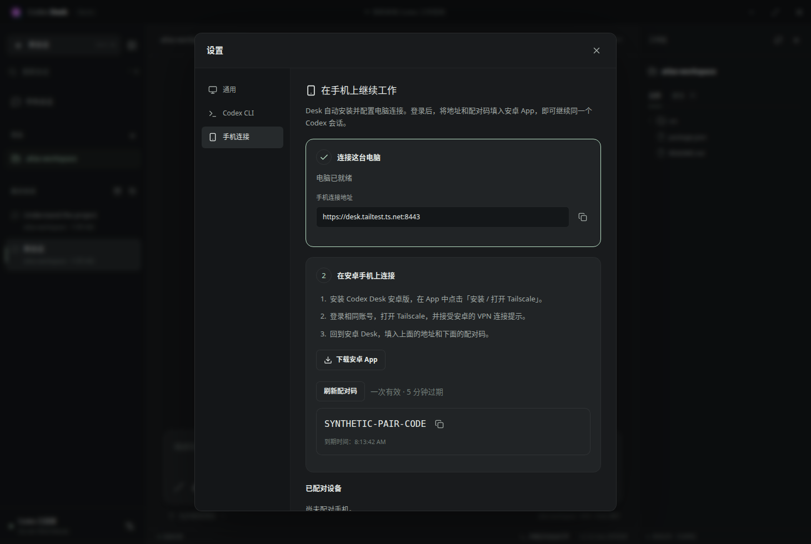

# Android + Tailscale

[English](#english) · [简体中文](#简体中文)

## English

Codex Desk for Android controls the Codex CLI running on your Ubuntu computer. It uses the same threads, history, model settings, permissions, approvals and goals as Desk and the shared CLI. Codex runs on the computer; the phone does not need a separate Codex installation or API key.


### Install and pair

1. Install **Codex Desk 0.3.1 or later** on Ubuntu and the Android APK from [Releases](https://github.com/moristeven477-ship-it/codex-desk/releases/latest) on Android 8.0 or later. Allow your browser/file manager to install the APK when Android asks. Keep Android System WebView or Chrome updated.
2. On the computer, open **Settings → Phone access → Set up phone access**. Desk downloads and verifies Tailscale if needed, starts its own connection without root privileges, and displays setup progress. A usable existing Tailscale connection is reused.
3. Click **Sign in to Tailscale** in Desk and complete the official browser login with the account you will use on your phone. If shown, click **Enable HTTPS** (or **Open device approval**) and complete that Tailscale page. **Desk continues automatically** and shows the computer address and a pairing code. No terminal commands or manual port configuration are needed. Use **Retry connection setup** if an authorization link expires.
4. Open Codex Desk on Android. Its first step offers **Install Tailscale** or **Open Tailscale**. Sign in with the same account, switch the connection on, accept Android’s VPN prompt, and return to Desk. Account sign-in and Android’s VPN consent remain actions you complete yourself.
5. Paste the complete `https://computer.tailXXXX.ts.net:8443` address into Android Desk, including `:8443`. Connect, then enter the pairing code and a device name. Codes expire after five minutes and work once; use **Refresh pairing code** when needed. Paired sessions last 30 days and can be revoked in desktop settings.

Closing the desktop window leaves Desk in the system tray while phone access is enabled. The computer must remain powered on, awake and logged in, with Desk running. **Quit** in the tray disconnects the phone; it does not terminate the shared Codex server or running tasks. Desk is not automatically started after reboot: launch it again after signing in.

Tailscale identifies each device independently of its Wi-Fi/cellular address. Changing networks does not require editing the computer address or allowlisting the phone's current public IP. MagicDNS is preferable to a numeric IP because Tailscale provides a valid HTTPS certificate for that hostname. See [Tailscale IP addresses](https://tailscale.com/docs/concepts/tailscale-ip-addresses) and [Tailscale Serve](https://tailscale.com/docs/features/tailscale-serve).

### Using the phone

- Send tasks, choose a startup mode, change model/effort/Fast, interrupt, or steer a running task. CLI settings win until you explicitly change a setting in Desk or Android.
- Pending steering remains visible. After a network change, the app reloads authoritative thread history. It never automatically resends submitted prompts or steering. If delivery is uncertain, inspect the conversation before sending again.
- Open history in the left drawer. Project paths refer to folders **on the computer**; enter their absolute paths when adding a project.
- Attach images with the Android document picker or paste supported clipboard images. Images are transferred to the computer and stored as private PNG files for Codex. Limit: eight per message, 20 MiB each.
- The `/` menu, goals, approvals, file/Git inspector and embedded actual Codex CLI are available. Mobile selection does not spawn Ubuntu Terminal tabs or change the desktop's selected conversation.
- Phone language, theme and font size are independent of the desktop. Project bookmarks and Codex settings are shared.
- Task-completion banners appear while the mobile interface is active. Android background push notifications are not included. Suspended WebViews reconnect when brought back to the foreground.
- Revoke a device in desktop **Phone access**, or choose **Unpair this phone** in mobile settings. This immediately ends that device's remote access and its embedded terminal connection, without stopping its running Codex task.

### Built-in Ubuntu setup



The desktop setup button handles installation on Ubuntu x86-64. It verifies the pinned official Tailscale static distribution with SHA-256 and starts a private userspace-networking daemon as `codex-desk-tailscale.service` under the current user’s systemd. It needs no root privileges, adds no system VPN interface, and does not change system DNS. The private endpoint is for inbound phone access to Desk. If an existing system connection can serve Desk, it is reused; permissions or port conflicts cause Desk to use its own endpoint instead of changing that connection’s VPN preferences.

Data: `~/.local/share/codex-desk/tailscale/`. Logs: `journalctl --user -u codex-desk-tailscale.service`. **Disable access** closes Desk’s gateway and cancels any setup in progress. It keeps your Tailscale login so the next setup can reuse it. For full removal of the private service, run `systemctl --user disable --now codex-desk-tailscale.service` before removing its files. This does not control a system Tailscale installation.

Source contributors can still use `node scripts/setup-tailscale-user.mjs` after `npm ci`; it shares the desktop installer. Tests may set `CODEX_DESK_TAILSCALE_HOME` to an isolated home directory for this endpoint. The distributed app uses your normal home directory by default.

### Connection and trust

The gateway listens only on `127.0.0.1:43125`. Tailscale Serve forwards tailnet HTTPS on port 8443 to it. There is no router port-forwarding and no Tailscale Funnel. Tailnet ACLs must allow your phone to reach this computer on TCP 8443.

A paired phone can control your coding agent with the same authority you grant through Codex, including explicit YOLO mode. Pair only your own trusted devices. A separate random session is kept in an HttpOnly, Secure, SameSite cookie. Only its hash is stored in the computer's private `remote.json`; pairing codes are kept in memory. Android validates TLS, blocks cleartext connections and uses no JavaScript-to-native bridge. The desktop can revoke access at any time. See [Security](../SECURITY.md).

If the phone cannot connect, check Tailscale is on, both devices are in the same tailnet, the computer is awake, Desk is running, and the full `https://…ts.net:8443` address matches desktop settings. A certificate error requires fixing Tailscale HTTPS or the device clock; the app does not bypass certificate errors.

### Build Android from source

Requirements: JDK 17, Android SDK platform 36, build-tools 35.0.0. The Gradle wrapper pins Gradle 8.13 with its distribution checksum. No Google Play services or account SDK is included.

```bash
cd android
./gradlew :app:testDebugUnitTest :app:lintRelease :app:assembleDebug
```

Install `app/build/outputs/apk/debug/app-debug.apk` for development. `assembleRelease` produces an unsigned release APK. The distributed release is signed with the maintainer's private key, kept outside the repository. Future official updates use that same key; self-built APKs need their own key and cannot replace an official installation without uninstalling it first. Back up the signing key when maintaining your own distribution. Run `JAVA_HOME=… ANDROID_HOME=… node scripts/sign-android.mjs` from the repository root to create or reuse a private release key under `~/.local/share/codex-desk/android-signing/`, align/sign the release APK, verify it and export the public certificate to `android/release-cert.pem`. Never commit that private signing directory.

## 简体中文

安卓版控制的是 **Ubuntu 电脑上正在运行的 Codex CLI**。手机、Desk、共享 CLI 使用同一会话、消息、权限、模型、审批和 goal；手机无需另装 Codex 或填写 API 密钥。

### 安装和配对

1. 从 [Releases](https://github.com/moristeven477-ship-it/codex-desk/releases/latest) 安装电脑端 **0.3.1 或更新版本**和安卓 APK。支持 Android 8.0 起；按安卓提示允许安装，并保持系统 WebView / Chrome 更新。
2. 电脑端打开「**设置 → 手机连接 → 一键设置手机连接**」。Desk 会自动下载校验、安装和启动 Tailscale；已有可用连接时会复用，无需终端命令或管理员密码。
3. 在 Desk 点击「**登录 Tailscale**」，到官方浏览器页面使用与手机相同的账号登录。若出现「**启用 HTTPS**」或设备审批按钮，点开完成后，**Desk 会自动继续**，显示连接地址并生成配对码。链接过期可点「重新获取连接」。
4. 打开安卓 Desk，第一步可直接「**安装 Tailscale**」或「**打开 Tailscale**」。登录相同账号，打开连接并接受安卓 VPN 提示，再回到 Desk。账号登录和安卓系统 VPN 授权仍需本人操作。
5. 填入电脑显示的完整 `https://电脑名.tailXXXX.ts.net:8443`，点击连接后输入配对码和设备名称。配对码五分钟内一次有效，过期在电脑点「刷新配对码」。配对登录保留 30 天，可在电脑随时撤销。

手机切换 Wi-Fi / 流量、外网 IP 改变都不需要重新设置电脑地址。使用 Tailscale 提供的固定设备域名和 HTTPS，电脑不需要公网端口映射。

启用手机连接后，关闭 Desk 窗口会留在托盘运行；托盘「退出」会断开手机，但不终止共享 Codex 任务。电脑需要保持开机、唤醒、已登录且 Desk 在运行；电脑重启登录后需重新打开 Desk。

### 手机操作

- 支持新会话启动模式、历史消息、模型/推理/Fast、停止、插话、审批、goal、`/` 菜单、文件/Git 查看及真实 CLI 终端。
- 一切以 CLI 设置为优先，只有主动修改时才覆盖。手机切换会话不抢占桌面当前页面，也不自动打开 Ubuntu Terminal 标签页。
- 插话立即可见；断网重连后以 CLI 历史校准。已提交内容不会自动重发，发送结果不确定时先查看会话。
- 图片通过安卓文件选择器添加，也支持浏览器能读取的剪贴板图片。图片保存在电脑侧，每条最多八张、每张 20 MiB。
- 添加项目时填写电脑上的绝对路径。手机语言、主题和字号独立保存，项目书签和 Codex 状态共享。
- App 活跃时显示顶部完成提示；暂未实现 Android 后台推送。返回 App 后会重连并更新历史。
- 在电脑「手机连接」撤销设备，或手机设置中「取消手机配对」，可结束访问；运行中的 Codex 任务仍保留。

电脑端的一键设置已内置免管理员安装：校验官方 Tailscale 下载后放入用户目录，使用用户级 systemd 和 userspace networking。关闭手机连接会停止 Desk 网关和当前设置流程，保留登录以便下次连接。已有系统 Tailscale 的 VPN 设置和其他服务会保留；权限不足或端口已占用时，Desk 使用独立连接。详细安装路径与卸载方式见上面的英文说明。

连接失败时依次确认 Tailscale 已打开、双方属于同一网络、电脑未休眠、Desk 已运行、地址含 HTTPS 和 `:8443`。首次需启用 Tailscale HTTPS，网络 ACL 需允许手机访问电脑 TCP 8443。证书错误不能跳过，应修正 HTTPS 配置或设备时间。
