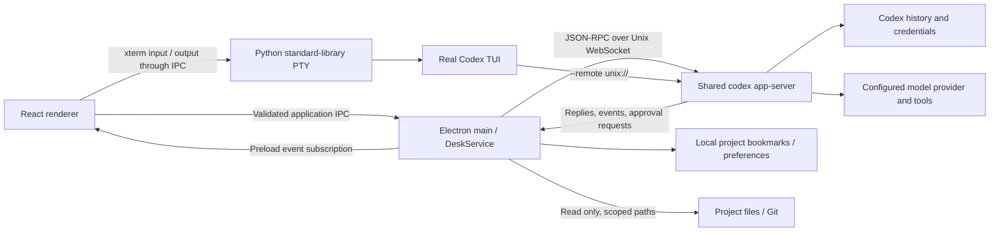

# Architecture



## Modules

| Module                             | Responsibility                                                                   |
| ---------------------------------- | -------------------------------------------------------------------------------- |
| `electron/main.ts`                 | Window lifecycle, native dialogs, trusted sender validation, link handling       |
| `electron/preload.ts`              | Minimal renderer bridge; no raw ipcRenderer access                               |
| `electron/codex.ts`                | CLI discovery, shared socket lifecycle, request correlation, timeouts, approvals |
| `electron/shared-server.ts`        | Official detached Unix listener fallback for npm installs                        |
| `electron/pty.ts`, `pty-bridge.py` | Real TUI sessions, framed private pipes, terminal sizing and lifecycle           |
| `electron/service.ts`              | Runtime input validation and application operations                              |
| `electron/store.ts`                | Version-tolerant preferences, serial atomic writes, corrupt-file preservation    |
| `electron/workspace.ts`            | Canonical path boundaries, capped file previews, read-only Git commands          |
| `src/lib/useDesk.ts`               | Project/thread state, subscriptions, per-thread caches, paginated history        |
| `src/lib/events.ts`                | Pure conversion of Codex notifications into conversation state                   |
| `src/components/`                  | Conversation, composer, approvals, inspector, settings and accessible dialogs    |

Application RPC methods are validated and allowlisted. The terminal can start only the selected Codex executable, connected to the same server and thread; terminal input remains interactive. It does not accept a renderer-provided shell executable or command line. Filesystem reads resolve the selected project in the main process. Native image selections are recorded in the main process before they can be sent as attachments.

## Protocol strategy

Validated against `codex-cli 0.154.0`. The application uses an intentionally small set of protocol types, not a forked Codex implementation. To inspect a future installation's actual schema:

```bash
codex app-server generate-ts --out /tmp/codex-desk-protocol --experimental
```

Initialization opts into experimental capabilities because Codex's interactive question and pagination surfaces can require them. History uses metadata reads and turn pagination, with a legacy full-history fallback for method/parameter incompatibility. Unsupported client requests receive a JSON-RPC error.

The renderer buffers notifications during asynchronous history hydration and merges final item snapshots rather than appending their text twice. A timeout or disconnect rejects outstanding calls and clears pending approvals. Each app instance owns a WebSocket client, not the shared server lifetime. The `ws` client disables per-message compression for the official Unix listener. The stdio transport remains available only to isolated protocol fixtures.

`thread/resume` subscribes to a live thread. An external standalone writer returns a readable snapshot and a retryable sync state; no writer is killed and no thread is automatically forked. The frontend retries visible external sessions every two seconds and refreshes the history list every three seconds. Server-request resolution from another client dismisses the matching approval.

New threads use the selected project or an automatically created default workspace. Codex chooses its supported history mode. Desk saves the returned Git branch through the official metadata API and requests the initial history snapshot so even an empty thread is materialized before the TUI resumes it. No synthetic user message, placeholder title, or goal is inserted.

Goals use `thread/goal/get`, `set`, and `clear`, and their corresponding notifications. Plan mode is carried as `collaborationMode` with the server's built-in instructions. The slash inventory is pinned to the CLI 0.154.0 source; terminal commands execute in the actual TUI, preserving upstream behavior, platform gates, and custom commands.

## Build

Vite builds static renderer assets. esbuild bundles main and preload code, leaving only Electron external, and copies the Python PTY bridge alongside the main bundle. electron-builder packages the application for Linux. Runtime `node_modules` are excluded because application dependencies are bundled. The embedded terminal uses the system Python 3 standard library.

Each build regenerates `THIRD_PARTY_NOTICES.txt` from the locked runtime dependency graph and includes it in the desktop application. Electron/Chromium license files are also included in the packaged runtime. File previews accept regular text files up to 1 MiB and render the first 3,000 lines; Git output is bounded separately.

Test fixtures never load real user credentials. Browser tests exercise React against `DeskService`, a real Unix WebSocket listener, and a deterministic backend. The same backend serves multiple independent clients in sync tests. Native smoke checks additionally exercise the packaged Electron preload/IPC and PTY boundaries. An opt-in live round trip verifies messages and goals against the real installed TUI.
