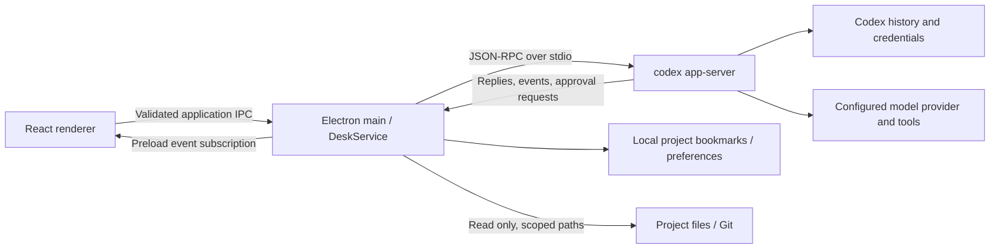

# Architecture



## Modules

| Module                  | Responsibility                                                                              |
| ----------------------- | ------------------------------------------------------------------------------------------- |
| `electron/main.ts`      | Window lifecycle, native dialogs, trusted sender validation, link handling                  |
| `electron/preload.ts`   | Minimal renderer bridge; no raw ipcRenderer access                                          |
| `electron/codex.ts`     | CLI discovery, process lifecycle, newline framing, request correlation, timeouts, approvals |
| `electron/service.ts`   | Runtime input validation and application operations                                         |
| `electron/store.ts`     | Version-tolerant preferences, serial atomic writes, corrupt-file preservation               |
| `electron/workspace.ts` | Canonical path boundaries, capped file previews, read-only Git commands                     |
| `src/lib/useDesk.ts`    | Project/thread state, subscriptions, per-thread caches, paginated history                   |
| `src/lib/events.ts`     | Pure conversion of Codex notifications into conversation state                              |
| `src/components/`       | Conversation, composer, approvals, inspector, settings and accessible dialogs               |

The app intentionally does not expose arbitrary RPC methods or shell execution through the renderer bridge. Filesystem reads resolve the selected project in the main process. Native image selections are recorded in the main process before they can be sent as attachments.

## Protocol strategy

Validated against `codex-cli 0.154.0`. The application uses an intentionally small set of protocol types, not a forked Codex implementation. To inspect a future installation's actual schema:

```bash
codex app-server generate-ts --out /tmp/codex-desk-protocol --experimental
```

Initialization opts into experimental capabilities because Codex's interactive question and pagination surfaces can require them. History uses metadata reads and turn pagination, with a legacy full-history fallback for method/parameter incompatibility. Unsupported client requests receive a JSON-RPC error.

The renderer buffers notifications during asynchronous history hydration and merges final item snapshots rather than appending their text twice. A timeout, disconnect or process exit rejects outstanding calls and clears pending approvals. Each app instance owns one subprocess and can load multiple workspace threads into it.

## Build

Vite builds static renderer assets. esbuild bundles main and preload code, leaving only Electron external. electron-builder packages the self-contained application for Linux. Runtime `node_modules` are excluded because application dependencies are bundled.

Each build regenerates `THIRD_PARTY_NOTICES.txt` from the locked runtime dependency graph and includes it in the desktop application. Electron/Chromium license files are also included in the packaged runtime. File previews accept regular text files up to 1 MiB and render the first 3,000 lines; Git output is bounded separately.

Test fixtures never load real user credentials. Browser tests exercise React against the real `DeskService` and a deterministic Codex subprocess. Native smoke checks additionally exercise the packaged Electron preload/IPC boundary.
