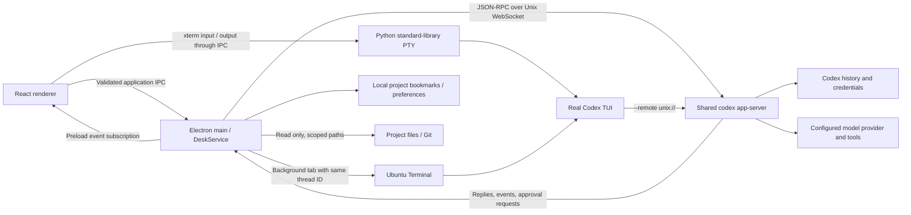

# Architecture



## Modules

| Module                             | Responsibility                                                                   |
| ---------------------------------- | -------------------------------------------------------------------------------- |
| `electron/main.ts`                 | Window lifecycle, native dialogs, trusted sender validation, link handling       |
| `electron/preload.ts`              | Minimal renderer bridge; no raw ipcRenderer access                               |
| `electron/codex.ts`                | CLI discovery, shared socket lifecycle, request correlation, timeouts, approvals |
| `electron/shared-server.ts`        | Official detached Unix listener fallback for npm installs                        |
| `electron/pty.ts`, `pty-bridge.py` | Real TUI sessions, framed private pipes, terminal sizing and lifecycle           |
| `electron/service.ts`              | Runtime input validation and application operations                              |
| `electron/store.ts`                | Version-tolerant preferences, serial atomic writes, corrupt-file preservation    |
| `electron/workspace.ts`            | Canonical path boundaries, capped file previews, read-only Git commands          |
| `src/lib/useDesk.ts`               | Project/thread state, subscriptions, per-thread caches, paginated history        |
| `src/lib/events.ts`                | Pure conversion of Codex notifications into conversation state                   |
| `src/components/`                  | Conversation, composer, approvals, inspector, settings and accessible dialogs    |

Application RPC methods are validated and allowlisted. The terminal can start only the selected Codex executable, connected to the same server and thread; terminal input remains interactive. It does not accept a renderer-provided shell executable or command line. Filesystem reads resolve the selected project in the main process. Native image selections are recorded in the main process before they can be sent as attachments.

## Protocol strategy

Validated against `codex-cli 0.154.0` and `0.155.1`. The application uses an intentionally small set of protocol types, not a forked Codex implementation. To inspect a future installation's actual schema:

```bash
codex app-server generate-ts --out /tmp/codex-desk-protocol --experimental
```

Initialization opts into experimental capabilities because Codex's interactive question and pagination surfaces can require them. History uses metadata reads and turn pagination, with a legacy full-history fallback for method/parameter incompatibility. Unsupported client requests receive a JSON-RPC error.

Turn history requests `itemsView: full`. Live turn notifications can instead carry `itemsView: summary` (only the final assistant answer) or `notLoaded`. The renderer merges those partial snapshots by item ID so user messages, steering input and tools remain visible. Only explicitly full snapshots replace the item list.

Fast reads `serviceTier` from thread start/resume responses and settings notifications. Its available tier comes from `model/list`, with compatibility for the deprecated `additionalSpeedTiers` field. An explicit toggle sends only `serviceTier` through `thread/settings/update`; the composer waits for both acknowledgement and matching settings notification. Clearing Fast accepts the CLI's normalized `default` value or null. Ordinary sends and steers omit service-tier overrides, and global CLI configuration stays unchanged.

`thread/compact/start` acknowledges submission immediately. Compaction progress and outcome come from `turn/*` and `item/*` events; the `contextCompaction` item itself has no status field, so the renderer derives it from its lifecycle. A failed pre-sampling compaction can have no items: the persisted turn error still renders a localized explanation and the original error details. Remote `content_filter` failures expose feedback and new-conversation guidance; other failures offer an explicit retry. Desk does not change providers, disable filters, erase history, or change CLI settings to recover. Before manual compaction, the service checks live thread status as well as observed turns, since another CLI can start work before Desk subscribes. Compaction is additionally validated with CLI 0.154.0 and 0.155.1 using a loopback provider.

The renderer buffers notifications during asynchronous history hydration and merges final item snapshots rather than appending their text twice. A timeout or disconnect rejects outstanding calls and clears pending approvals. Each app instance owns a WebSocket client, not the shared server lifetime. The `ws` client disables per-message compression for the official Unix listener. The stdio transport remains available only to isolated protocol fixtures.

`thread/resume` subscribes to a live thread. An external standalone writer returns a readable snapshot and a retryable sync state; no writer is killed and no thread is automatically forked. The frontend retries visible external sessions every two seconds and refreshes the history list every three seconds. Server-request resolution from another client dismisses the matching approval.

New threads use the selected project or an automatically created default workspace. Codex chooses its supported history mode. Desk saves the returned Git branch through the official metadata API and requests the initial history snapshot so even an empty thread is materialized before the TUI resumes it. No synthetic user message, placeholder title, or goal is inserted.

Goals use `thread/goal/get`, `set`, and `clear`, and their corresponding notifications. Plan mode is carried as `collaborationMode` with the server's built-in instructions. The slash inventory is pinned to the CLI 0.154.0 source; terminal commands execute in the actual TUI, preserving upstream behavior, platform gates, and custom commands.

## Message interaction

Steering calls the official [`turn/steer`](https://learn.chatgpt.com/docs/app-server#steer-an-active-turn) method with the captured active `expectedTurnId`. The service accepts only text and authorized images, forwards no model/permission overrides, and never retries a rejected steer as a new turn. CLI notifications remain authoritative for message history. Accepted submissions clear only the submitted draft/attachments; later typing stays intact.

Message copying uses a narrow, trusted-sender-validated clipboard-write IPC method. It writes the original text/Markdown, not the conversation or rendered HTML, without requesting renderer clipboard-read access. Font size is a bounded local preference: rem-based text scales from the 13 px default, and embedded xterm sizing updates without restarting its PTY. Font drags preview locally once per animation frame with fractional sizes and an 80 ms CSS transition (disabled for reduced motion). Pointer release, keyboard release, blur or closing Settings saves the current value, keeping disk writes and full conversation renders out of the drag path. Preference writes remain serialized; native terminal profiles and Codex settings are unaffected.

## Build

### Background Ubuntu terminals

New-conversation screens materialize an empty Codex thread immediately. Selection and creation ask a narrow native IPC method to prepare its terminal. The main process resolves the real CLI binary, home, workspace and `--remote unix:// resume ID` arguments. Standalone writers are left alone. Generation checks keep slow creation from replacing a later selection; composer identity stays stable while the ID is allocated.

`background-terminal.ts` serializes requests and coalesces simultaneous requests for one thread. The Python GObject helper connects to a dedicated GNOME Terminal server with its own application ID, reuses only Desk-recorded screens, and executes argument arrays through D-Bus. Private process markers include PID plus process start time to distinguish reused PIDs. Unique D-Bus owner IDs prevent stale screen paths from matching a restarted server. Neither screen records nor markers contain credentials. Native terminals outlive Desk; closing the embedded modal still closes only its own PTY.

GNOME Terminal 3.52 presents a newly created window even when its factory receives `present-window=false` ([upstream implementation](https://github.com/GNOME/gnome-terminal/blob/3.52.0/src/terminal-gdbus.cc)). `background-window.c` intercepts GTK presentation only inside Desk's dedicated terminal server, only for its window role, and only on first presentation. It sets focus-on-map off and requests iconification before mapping. Later tabs use `active=false` and `present-window=false`; manual restoration works normally. The library is never installed into or loaded by the user's existing terminal server, and its preload setting is cleared before launching Codex. Tests assert actual X11 focus, minimized state, active tab, process reuse and keyboard input under a separate window manager.

The helper is compiled with the host C compiler and packaged outside ASAR so the system loader can read it. Runtime requires GNOME Terminal, Python 3 and Python GObject bindings. The validated target is Ubuntu 24.04 X11; Wayland presentation has not been separately validated.

Vite builds static renderer assets. esbuild bundles main and preload code, leaving only Electron external, and copies the Python PTY bridge alongside the main bundle. electron-builder packages the application for Linux. Runtime `node_modules` are excluded because application dependencies are bundled. The embedded terminal uses the system Python 3 standard library.

Each build regenerates `THIRD_PARTY_NOTICES.txt` from the locked runtime dependency graph and includes it in the desktop application. Electron/Chromium license files are also included in the packaged runtime. File previews accept regular text files up to 1 MiB and render the first 3,000 lines; Git output is bounded separately.

Test fixtures never load real user credentials. Browser tests exercise React against `DeskService`, a real Unix WebSocket listener, and a deterministic backend. The same backend serves multiple independent clients in sync tests. Native smoke checks additionally exercise the packaged Electron preload/IPC and PTY boundaries. An opt-in live round trip verifies messages and goals against the real installed TUI.
