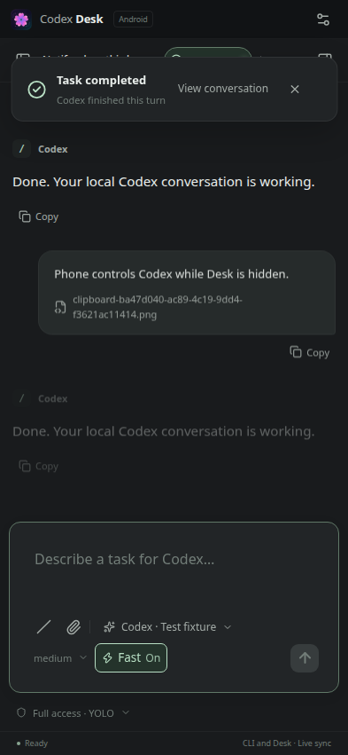

# Release validation — 0.3.1

Validated on Ubuntu 24.04.4 x86-64 (X11), Node.js 22.23.2 and Electron 44.3.0 on 2026-09-28.

## Checks

| Check                                       | Result / coverage                                                                                                                                                                                                                                                                                                                                                                                                                   |
| ------------------------------------------- | ----------------------------------------------------------------------------------------------------------------------------------------------------------------------------------------------------------------------------------------------------------------------------------------------------------------------------------------------------------------------------------------------------------------------------------- |
| Formatting, TypeScript and production build | Passed                                                                                                                                                                                                                                                                                                                                                                                                                              |
| Unit / protocol integration                 | 32 passed; includes verified Tailscale downloads/cache handling, setup continuation/cancellation/retry, system connection preservation, private fallback, HTTPS route verification and authorization URLs; plus pairing authentication, Origin restrictions, one-use codes, private token hashes, revocation, RPC deduplication, device preferences, same-thread steering, CLI permissions, gateway restart without cancelling work |
| Existing desktop workflows                  | 25 passed; Chinese in-app phone setup progress, login/retry, automatic pairing and disabling access; plus model/Fast, permissions, history, compaction, copy, images, steering, goals, approval, notifications and background terminal regressions                                                                                                                                                                                  |
| Phone browser workflows                     | 3 passed at 393 × 851 and 360 × 460; pairing, sends, independent preferences, drawer navigation, real CLI panel, image upload, approvals/goals, revocation, visible steering and network recovery without prompt replay                                                                                                                                                                                                             |
| Unmodified Tailscale CLI                    | 1.102.4 private daemon reached the in-app login stage with an official login URL; setup cancellation preserved the daemon. Account authorization was not completed                                                                                                                                                                                                                                                                  |
| Packaged Ubuntu AppImage                    | Passed: existing native clipboard, images, font, goal, compaction, steering, notifications and background-terminal checks; plus the in-app login → HTTPS authorization → automatically configured address and pairing flow with an isolated Tailscale executable fixture, phone image normalization/private storage, completed phone turn while desktop window is closed, and device revocation                                     |
| Android build and artifacts                 | 2 endpoint unit tests passed; release lint completed without errors; release APK assembled, aligned and signature-verified. SHA-256 checksums accompany APK, AppImage and .deb. Ubuntu package source bundles match.                                                                                                                                                                                                                |

The desktop regression server uses a dedicated strict port, never an unrelated existing Vite server. Native checks run on a separate Xvfb display and D-Bus session; real CLI checks use temporary workspaces and CODEX_HOME. They do not interact with existing coding sessions.

## Remote behavior and limits

The phone talks to the same `DeskService` as Electron. It preserves thread IDs and inherits Codex settings unless explicitly changed. A network loss disconnects the phone, not Codex; reconnect refreshes history and pending approvals. HTTP prompts and steering are never automatically replayed. Device revocation closes its WebSocket and owned embedded terminals while keeping shared Codex tasks alive.

The Codex integration is unchanged from 0.3.0, which was also validated with unmodified CLI 0.157.1; this release reran native and protocol regressions rather than repeating its live provider checks.

Phone tests use real HTTP/WS transport and synthetic official-protocol fixtures. The native test adds Electron's actual image decoder and packaged service. Android endpoint unit tests cover normalization, origin matching and rejection of unsafe addresses. Browser viewport tests exercise touch layout but do not certify a physical Android device.

No physical Android phone was attached during validation. End-to-end routing through a signed-in Tailscale tailnet and Wi-Fi/cellular handover on a real handset require the user's device/account. The computer's private userspace Tailscale daemon is installed; account login remains separate from local gateway validation. Android background push notifications are not implemented.



## Reproduce

```bash
npm ci
npm run format:check
npm run typecheck
npm test
npm run test:e2e
npm run test:remote
npm run test:steer
npm run package:linux
APPIMAGE_EXTRACT_AND_RUN=1 DESK_TEST_CLIPBOARD=1 DESK_TEST_NO_SANDBOX=1 \
  DESK_EXECUTABLE="$PWD/release/codex-desk-0.3.1-x86_64.AppImage" \
  npm run test:native
cd android
./gradlew :app:testDebugUnitTest :app:lintRelease :app:assembleRelease
```

`DESK_TEST_NO_SANDBOX` only selects the command-line workaround for the isolated Xvfb test environment; renderer isolation remains asserted. Normal installation instructions do not disable Chromium's sandbox.

Earlier release validation: [0.3.0](VALIDATION-0.3.0.md), [0.2.7](VALIDATION-0.2.7.md).
