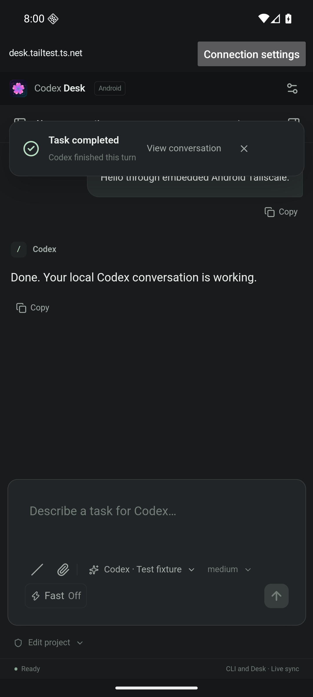

# Validation — 0.4.0

Validated on Ubuntu 24.04 with the packaged Electron application, Go 1.27.1, Tailscale 1.102.4, Android SDK 36 / NDK 29.0.14206865 and an isolated Android 16 x86_64 emulator. All CLI conversations and workspaces in tests are synthetic.

| Check                          | Result                                                                                                                                                                                                                                                                                                                                                                                            |
| ------------------------------ | ------------------------------------------------------------------------------------------------------------------------------------------------------------------------------------------------------------------------------------------------------------------------------------------------------------------------------------------------------------------------------------------------- |
| Desktop protocol/unit tests    | 32 passed. Existing pairing, authentication, permissions, steering, goals, gateway lifecycle and desktop Tailscale setup remain covered.                                                                                                                                                                                                                                                          |
| Desktop browser workflows      | 25 passed, including Chinese phone setup, CLI settings inheritance, history, images, compaction, steering, fonts and notifications.                                                                                                                                                                                                                                                               |
| Phone browser workflows        | 3 passed: tasks, steering, network recovery without replay, uploads, approvals, goals and revocation.                                                                                                                                                                                                                                                                                             |
| Packaged Ubuntu AppImage       | Native checks passed: IPC, shared Unix WebSocket, actual PTY, background GNOME Terminal reuse/survival, clipboard, images, permissions, goals, notifications, phone setup and gateway.                                                                                                                                                                                                            |
| Go embedded transport          | 5 tests passed with the race detector: destination restrictions before dialing, HTTPS certificate verification, buffered bidirectional tunnels, closing old tunnels on endpoint change, Android interface snapshots.                                                                                                                                                                              |
| Android endpoint unit tests    | 3 passed: address normalization/origin matching, invalid destinations, official login URL restrictions.                                                                                                                                                                                                                                                                                           |
| Actual Android APK integration | Fresh and resumed process scenarios passed without an external Tailscale app. Two real tsnet nodes and a local official test coordinator carried HTTPS/WebSocket traffic to the real Desk gateway. Pairing, a completed message, network rebind, engine restart, Activity recreation, process restart, cookie persistence, no duplicate prompts and rejection of an untrusted certificate passed. |

The Android integration harness generates an ephemeral test certificate. Only the `.integration` test APK trusts it. Debug and release APKs use system certificate trust. Native node keys stay in app-private, non-backed-up storage. Test artifacts never contain real Codex history or account credentials.

The release APK contains native engine libraries for arm64-v8a, armeabi-v7a and x86_64; Go dependencies and AndroidX license texts ship in the APK. Signing preserves the existing release certificate and verifies 16 KiB ZIP alignment. Published downloads include SHA-256 checksums.

## Scope and limits

The Codex integration remains unchanged: the phone reaches the existing shared `DeskService`, preserving thread IDs and inheriting CLI settings until explicitly changed. Development and validation use isolated workspaces, displays, D-Bus sessions and an emulator; existing coding sessions are untouched.

The Android test uses the official Tailscale engine and real WireGuard transport with a local test coordinator, not a signed-in production account. No physical Android phone was attached. Account authorization and actual Wi-Fi/cellular handover on a handset still require the user's account/device. Background Android push notifications are not included. The app reconnects on return to the foreground and never automatically resends prompts.

The local emulator required `-gpu swangle -feature -Vulkan` because its SwiftShader GLES renderer crashed while drawing WebView; the passing tests use ANGLE software rendering. This does not change APK behavior.



## Reproduce

```bash
npm ci
npm run format:check
npm run typecheck
npm test
npm run test:e2e
npm run test:remote
npm run package:linux
APPIMAGE_EXTRACT_AND_RUN=1 DESK_TEST_CLIPBOARD=1 DESK_TEST_NO_SANDBOX=1 \
  DESK_EXECUTABLE="$PWD/release/codex-desk-0.4.0-x86_64.AppImage" npm run test:native
cd android
./gradlew :app:testDebugUnitTest :app:lintRelease :app:assembleRelease
cd tailnet
go test -race ./...
DESK_ANDROID_EMBEDDED=1 ANDROID_SERIAL=emulator-5554 \
  go test -timeout=25m -run TestAndroidEmbeddedEndToEnd -v
```

Set `JAVA_HOME`, `ANDROID_HOME` and put Go 1.27.1 / Node.js 22+ on `PATH`; install SDK 36, build-tools 35.0.0 and NDK 29.0.14206865. The Android integration command builds and installs its own isolated test packages. GitHub CI runs the same emulator test. See [Android build instructions](ANDROID.md#build-android-from-source).

`DESK_TEST_NO_SANDBOX` applies only to the isolated native test display; Electron renderer isolation is still asserted. Earlier validation: [0.3.1](VALIDATION-0.3.1.md), [0.3.0](VALIDATION-0.3.0.md).
