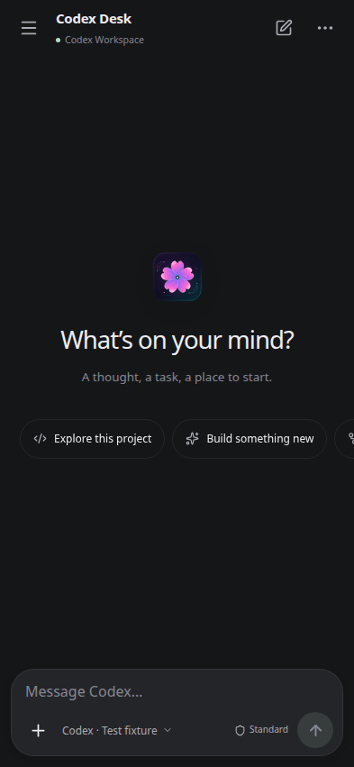
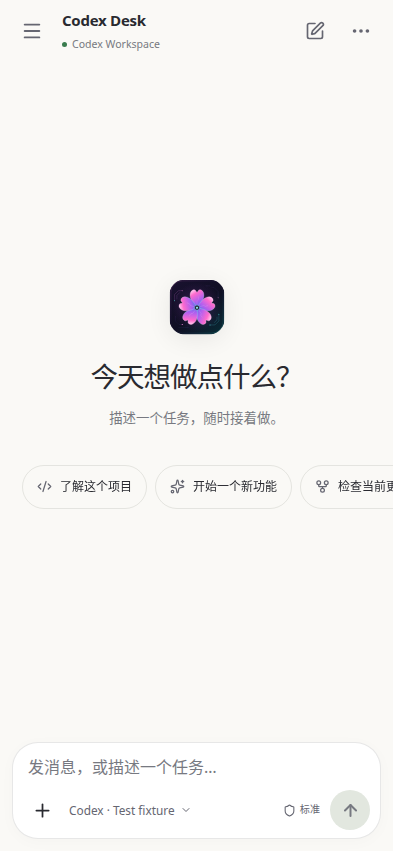
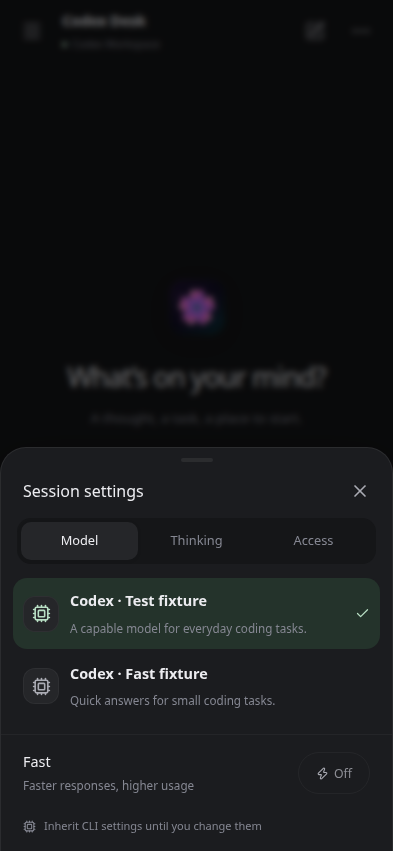
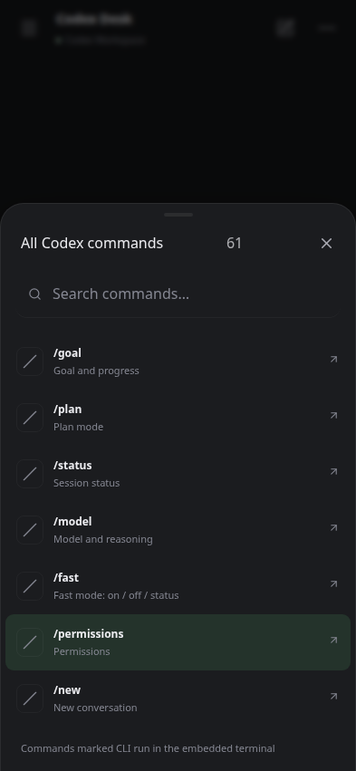
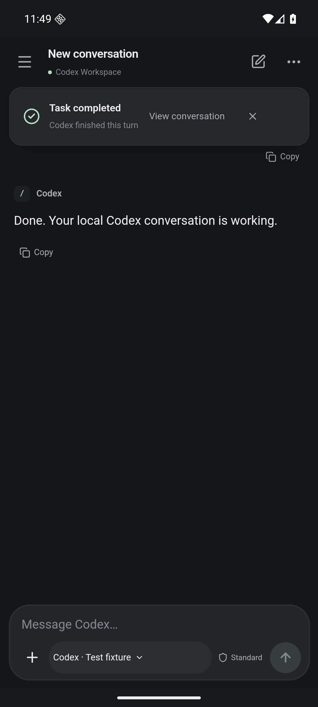

# Mobile interface validation — 0.5.0

## Changes

The paired phone interface has a single conversation header and an approximately 100 CSS-pixel composer at the default font size. The textarea starts at one line, grows with the draft, and scrolls once it reaches 128 px or 24% of the visible viewport. Mobile Enter inserts a newline; the Send button and Ctrl/Command+Enter submit. Slash-command Enter keeps its command behavior.

Model, thinking effort, access and Fast are grouped in a bottom sheet. The adjacent permission label opens Access directly. The + sheet contains images, all 61 slash-menu entries and Plan mode. The header keeps history, new conversation, a compact goal badge and a conversation menu. Mobile settings still expose the continuous font slider. These controls keep the existing shared CLI operations and do not override settings merely by opening a menu.

The Android shell advertises its version in the user agent. With the new web shell it hides the redundant hostname/connection toolbar; older servers retain that toolbar. A same-origin connection-settings link is handled only for a main-frame navigation with a user gesture. No JavaScript-to-native bridge is added. Android 13+ uses OnBackInvokedDispatcher; Android 8–12 retains the legacy Back callback. Back dismisses a visible software keyboard first. A cancelable Escape event then lets the current sheet or drawer consume Back, before the app can move to the background.

A first-send race was also reproduced: when a prompt was submitted before thread creation completed, the draft moved to the new thread ID but the send callback cleared its old temporary key. The composer now uses the latest draft callback and clears only unchanged text. A regression delays thread creation to reproduce the original failure, then verifies that a later draft typed during another send survives both completion and reload.

## Checks

| Check                                        | Result                                                                                                                                                                                                                                                                                                                                                                                                                                                                                                                                                                                         |
| -------------------------------------------- | ---------------------------------------------------------------------------------------------------------------------------------------------------------------------------------------------------------------------------------------------------------------------------------------------------------------------------------------------------------------------------------------------------------------------------------------------------------------------------------------------------------------------------------------------------------------------------------------------- |
| TypeScript and production build              | Passed.                                                                                                                                                                                                                                                                                                                                                                                                                                                                                                                                                                                        |
| Service/unit checks                          | 35 passed. Shared CLI history, permission inheritance, steering, compaction, approvals and remote transport retained.                                                                                                                                                                                                                                                                                                                                                                                                                                                                          |
| Desktop browser regression                   | 25 passed, including the existing model menu, font slider, copy buttons, images, steering, goals and startup modes.                                                                                                                                                                                                                                                                                                                                                                                                                                                                            |
| Mobile browser regression                    | 7 passed using a real HTTP/WebSocket gateway and synthetic CLI. Covers compact height, multiline draft retention, ordinary Enter, 320 px portrait / 851 px landscape, short keyboard-sized viewports, maximum font size, CN/EN and dark/light, model/thinking/Fast selection, CLI inheritance, YOLO, all commands, approvals, attachments, goals, history, steering and reconnect without duplicate sends.                                                                                                                                                                                     |
| Android unit tests and release lint          | Endpoint tests passed; release lint passed. Warnings concern the intentionally version-specific manifest Back flag and newer available Gradle.                                                                                                                                                                                                                                                                                                                                                                                                                                                 |
| Android 16 emulator, real embedded transport | Fresh and resumed processes passed. Uses two real tsnet nodes, a local official test coordinator, actual WebView and a synthetic CLI. Includes the 320 × 640 emulator configuration used in CI and checks that a submitted draft clears. Tests physical screen taps, visible soft keyboard, Send above the keyboard, system Back dismissal of tools/session sheets, removal of the duplicate toolbar and the native connection link. Also checks pairing, network rebind, engine/Activity/process restarts, cookie persistence, no repeated prompts and rejection of an untrusted certificate. |

The Android certificate matches earlier releases, allowing an in-place APK upgrade. APK contents include the embedded engine for arm64-v8a, armeabi-v7a and x86_64, with 16 KiB ZIP alignment. Private credentials and real conversations are excluded from tests and screenshots.

The packaged Ubuntu AppImage also passed native Electron IPC, background GNOME Terminal reuse and survival after Desk closes, clipboard/image import, YOLO, font controls, steering, compaction, completion notices, and phone image upload/send/revocation while the desktop window was hidden.

## Visual review

Screenshots use only the synthetic Atlas workspace. References were the developer-published mobile screenshots for [Gemini](https://play.google.com/store/apps/details?id=com.google.android.apps.bard), [Grok](https://play.google.com/store/apps/details?id=ai.x.grok), and [Claude](https://play.google.com/store/apps/details?id=com.anthropic.claude): restrained conversation chrome, compact input and secondary controls in sheets. Desk uses its own sakura artwork, colors and controls.

 

 



## Scope

No physical handset was attached. The emulator verifies a real software keyboard, WebView, TLS and embedded Tailscale engine, using a local test coordinator rather than a production account. Actual Wi-Fi/cellular transitions on a handset and OEM keyboard variations remain outside this run. Background push notifications are unchanged.

## Reproduce

```sh
npm ci
npm run format:check
npm run typecheck
npm test
npm run test:e2e
npm run test:remote
npm run package:linux
DESK_EXECUTABLE="$PWD/release/codex-desk-0.5.0-x86_64.AppImage" npm run test:native
cd android
./gradlew :app:testDebugUnitTest :app:lintRelease :app:assembleRelease --no-daemon
cd tailnet
ANDROID_SERIAL=emulator-5554 DESK_ANDROID_EMBEDDED=1 go test -p=4 -timeout=25m -run TestAndroidEmbeddedEndToEnd -v
```

See [Android setup](ANDROID.md#build-android-from-source) for SDK/Go prerequisites and the emulator's software GPU flags. Use dedicated emulator and temporary test workspaces.
