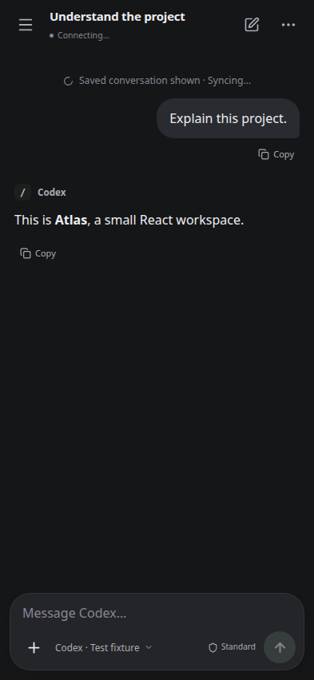
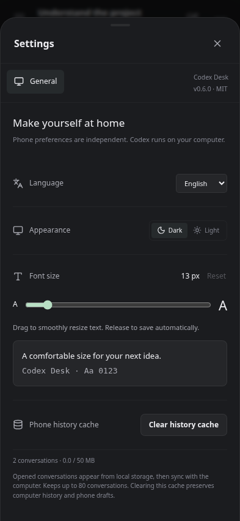

# Persistent phone history — 0.6.0

## Result

Previously the phone lost its in-memory history when its WebView restarted. Selecting a conversation also hid already loaded messages behind a spinner and waited for a separate Goal request. The phone now stores opened conversations, history lists and display preferences in IndexedDB. Local messages appear first; fresh CLI history replaces them in the background. Cached approvals and permissions never authorize a send. Goal loading no longer blocks the chat.

The cache is scoped to the computer origin and pairing ID. It retains up to 80 conversations and 50 MiB per pairing, evicts least-recently-used entries, and skips individual snapshots over 25 MiB. Storage usage and clearing are available in **⋯ → Settings → Phone history cache**. Clearing preserves computer history and phone drafts. Signing out or observing HTTP 401 clears the pairing's local data. The cache contains no auth tokens and does not queue or replay input.

## Checks

- **38 unit/service tests passed**, including full/rolled-back history replacing stale cached turns and preserving older pages only with a matching boundary.
- **25 desktop browser workflows passed**, retaining native-terminal preparation, CLI priority, permissions, images, Fast, steering, goals and compaction.
- **13 phone browser workflows passed**: six cache tests plus the existing seven phone workflows. Includes fresh CLI reconciliation without duplicate messages, rapid selection with delayed responses, clearing without deleting drafts/computer history, pairing isolation and unpair cleanup, LRU/byte limits, malformed snapshots, unavailable storage, restoring an empty conversation without creating another, and the existing message/permission/steering/image controls.
- With session, bootstrap and history requests deliberately held open, the synthetic cached conversation appeared in **133–243 ms** across local runs on this workstation. This demonstrates independence from the delayed network requests, not a handset performance guarantee. The history list also appeared locally; messages became writable only after authoritative history arrived. A separately blocked Goal request did not delay the messages.
- Concurrent identical reads are coalesced. The delayed-start test observed one bootstrap and one history request. Mobile list polling is reduced from three to 15 seconds; live events still trigger refreshes.
- **Packaged Ubuntu AppImage passed** native IPC, clipboard/images, YOLO, steering, goals, compaction, completion notices, background terminal reuse/survival and phone access while hidden.
- **Android release unit tests and lint passed**. The signed APK retains the existing certificate and all three embedded-engine ABIs. The Android 16 320 × 640 emulator passed fresh and resumed processes over actual embedded tsnet/TLS: IndexedDB contents survive process restart, with pairing, keyboard, Back, network rebind, engine/Activity/process restarts, no duplicate sends and rejection of an untrusted certificate.

## Screenshots

Screenshots use only the synthetic Atlas workspace.

 

## Limits

No physical handset is attached. IndexedDB persistence is scoped to the WebView/browser profile and can be cleared by Android or the user. App-shell navigation still loads from the computer: this release does not implement a service worker or complete offline startup. Unread histories, sending, and confirmations still require the computer. Live OEM keyboard and Wi-Fi/cellular variations are outside this run. Existing pending-input delivery rules and desktop CLI processes remain unchanged.

## Reproduce

```sh
npm ci
npm run format:check
npm run typecheck
npm test
npm run test:e2e
npm run test:remote
npm run package:linux
DESK_EXECUTABLE="$PWD/release/codex-desk-0.6.0-x86_64.AppImage" npm run test:native
cd android
./gradlew :app:testDebugUnitTest :app:lintRelease :app:assembleRelease --no-daemon
cd tailnet
ANDROID_SERIAL=emulator-5554 DESK_ANDROID_EMBEDDED=1 go test -p=4 -timeout=25m -run TestAndroidEmbeddedEndToEnd -v
```

Use dedicated temporary workspaces/emulators. See [Android build prerequisites](ANDROID.md#build-android-from-source).
