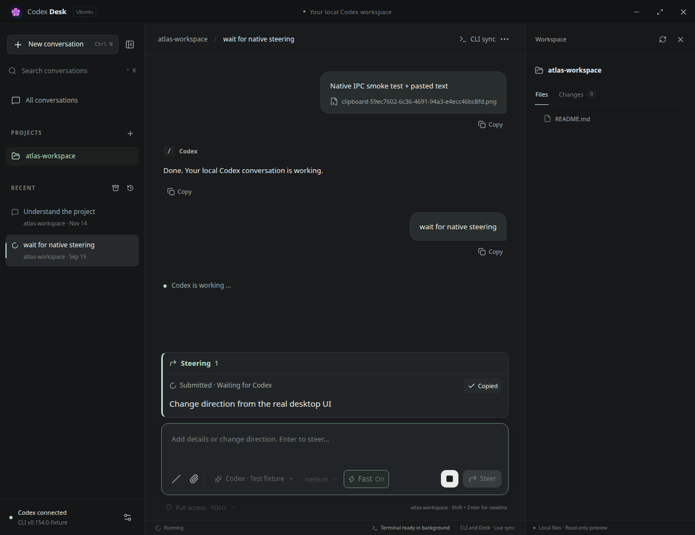

# Release validation — 0.2.7

Validated on Ubuntu 24.04.4 x86-64 (X11), Node.js 22.23.2 and Electron 44.3.0 on 2026-09-19.

## Checks

| Check                                       | Result / coverage                                                                                                                                                                                                                        |
| ------------------------------------------- | ---------------------------------------------------------------------------------------------------------------------------------------------------------------------------------------------------------------------------------------- |
| Formatting, TypeScript and production build | Passed                                                                                                                                                                                                                                   |
| Unit / protocol integration                 | 23 tests passed; receipt correlation, uncertain delivery, summary merging, settings inheritance, shared clients and permissions                                                                                                          |
| Browser workflows                           | 24 tests passed; pending steering text/images, delayed acknowledgement/consumption, duplicate text with distinct IDs, reload/navigation, interruption, bilingual copy/status and viewport visibility                                     |
| Unmodified Codex CLI                        | 0.154.0 and 0.155.1 passed isolated loopback Responses checks: acknowledgement before consumption, official client IDs in events/persisted history, one shared turn, unchanged YOLO and Fast synchronization                             |
| Packaged AppImage                           | Passed: visible pending content through native IPC, reload persistence, native clipboard copy, exactly one visible message after delivery; existing image/clipboard, compaction, goal, font, notification and background terminal checks |
| Ubuntu artifacts                            | AppImage executed; .deb version/architecture checked; .deb and tested application source bundles match; SHA-256 checksums generated                                                                                                      |

## Steering behavior

The real CLI can acknowledge `turn/steer` before it emits a user-message item. The local provider holds a model response to reproduce that interval. Desk immediately keeps a visible local receipt above the composer and sends a unique `clientUserMessageId`. An official user message with the matching `clientId` replaces the pending display, including when the notification arrives before the request acknowledgement. Identical text is never used to correlate messages.

Only text and attachment paths are saved locally. Switching conversations or reopening the window restores pending receipts; they are never automatically resent. A request error, interrupted/completed turn without receipt, or reload during submission keeps the content with an unconfirmed status. A later official receipt remains authoritative. Hiding an uncertain notice only removes the local display; it does not withdraw input from Codex.

The browser tests assert viewport visibility after scrolling up, submitting steering, delayed receipt and reopening a long conversation. The native test exercises the packaged AppImage, reloads while delivery is deferred, copies the pending text through the native clipboard, then verifies one official visible message. The screenshot below contains synthetic test data only.



## Reproduce

```bash
npm ci
npm run format:check
npm run typecheck
npm test
npm run test:e2e
npm run test:steer
npm run package:linux
APPIMAGE_EXTRACT_AND_RUN=1 DESK_TEST_CLIPBOARD=1 DESK_TEST_NO_SANDBOX=1 \
  DESK_EXECUTABLE="$PWD/release/codex-desk-0.2.7-x86_64.AppImage" \
  npm run test:native
```

`test:steer` uses the installed CLI with a temporary workspace, CODEX_HOME and loopback Responses provider. `DESK_LIVE_BINARY` selects an executable. It uses no account, external model request or user conversation. Both 0.154.0 and 0.155.1 were exercised. Test cleanup reaps only its own isolated server process group.

## Limits and unchanged protocol behavior

A pending receipt records what Desk submitted; it does not promise that the model has consumed it. Receipt requires an official CLI message with its client ID. Inputs submitted by other clients become visible when the shared server emits them or history is read. Desk does not have a separate copy of another client's unsent input.

Steering uses the current CLI turn and omits model, effort, permission and service-tier overrides. Conversation IDs and stored history remain authoritative. Summary completion merging and confirmed Fast settings are covered in [the 0.2.6 validation](VALIDATION-0.2.6.md).

The native run uses a private Xvfb display and D-Bus session, with the Chromium OS sandbox disabled for the isolated test environment. Context isolation, disabled Node integration and the renderer sandbox preference are checked; OS sandbox enforcement is not validated. Prerequisites are in [the 0.2.4 validation](VALIDATION-0.2.4.md).
